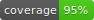

# Forum

<p align="center">
    <a href="/LICENSE.md">
        
    </a>
    <a href="/LICENSE.md">
        
    </a>
    <a href="https://github.com/HarrisFauntleroy/forum/graphs/contributors">
        
    </a>
    <a href="https://github.com/HarrisFauntleroy/forum/actions">
        
    </a>
    <a href="https://github.com/HarrisFauntleroy/forum/issues?q=is%3Aopen+is%3Aissue">
        
    </a>
    <a href="https://github.com/HarrisFauntleroy/forum/issues?q=is%3Aopen+is%3Aissue">
        
    </a>
    </a>
    <a href="https://github.com/HarrisFauntleroy/forum/issues?q=is%3Aopen+is%3Aissue">
        
    </a>
</p>

<!-- PROJECT_DESCRIPTION -->

<!-- 🚧 -->

<!-- PROJECT_SCREENSHOT -->

<!-- 🚧 -->

---

## Table of Contents ⚙️

1. [Features](#features-💫)
2. [Local Development](#local-development-💻)
3. [Contributing](#contributing-🤝)
4. [License](#license-⚖️)
5. [Disclaimer](#disclaimer-🚨)

## Features 💫

- 🚧

---

## Local Development 💻

Here's how you can set up forum in your local dev environment:

**Requirements**

<!-- LIST OF REQUIREMENTS -->

- Ruby >= 3.0.6
<!-- - Docker (for running Postgres, Redis, etc.) 🐳 -->

Ruby is managed using Ruby Version Manager

<!-- <a href="https://github.com/nvm-sh/logos"></a> -->

```bash
# Update ruby version
rvm use <version>
```

**Installation**

<!-- INSTALLATION INSTRUCTIONS -->

Install the required gems by running the following command:

```bash
bundle install
```

To migrate the database, run the following command:

```bash
rails db:migrate
```

```bash
rails db:create db:migrate db:seed
```

To run the specs, a single spec, or a single test:

```bash
rails rspec
rspec spec/controllers/user_controller_spec.rb
rspec spec/controllers/user_controller_spec.rb:32 
```

To start the server, run the following command:

```bash
rails server
rails s
```

To run the rails console, run the following command:

```bash
rails console
rails c
```

**Commands**

<!-- LIST OF COMMANDS -->

The format `.erb` files with erb-format

```bash
rails erb-format app/views/**/*.html.erb --write 
```

The run Rubocop

```bash
rubocop                           
```

<!-- _Please refer to the package.json for additional details and scripts._ -->

## Contributing 🤝

<!-- GUIDELINES FOR CONTRIBUTION -->

## License ⚖️

<!-- Distributed under the MIT License. See `LICENSE` for more information. -->

## Disclaimer 🚨

This software is currently a work in progress and is considered in ALPHA state.
Features will appear and disappear, APIs will be changed, bugs will be
introduced, your feedback is always welcome! 🚧🔧
